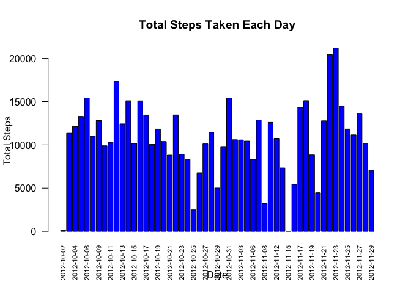
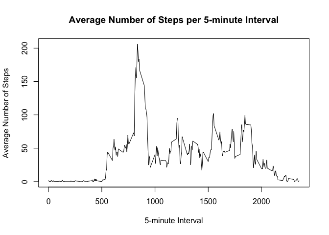
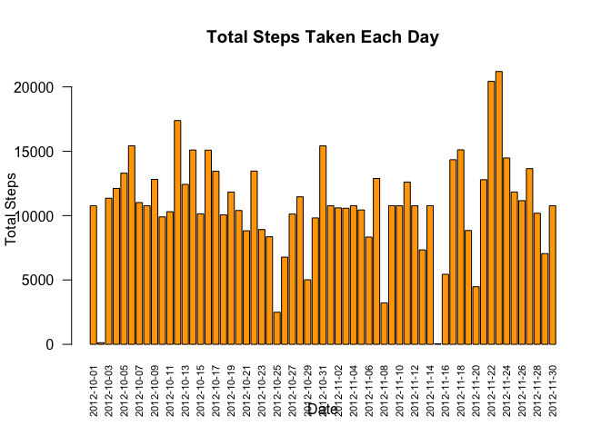
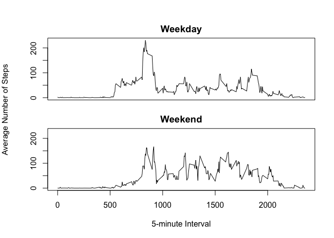

## Loading and preprocessing the data

```r
data <- read.csv("activity.csv", header = TRUE, sep = ",")
clean_data <- na.omit(data)
```


## What is mean total number of steps taken per day?


```r
#aggregate the data
total_steps_per_day <- aggregate(steps ~ date, data = clean_data, sum)
#create the histogram 
barplot(height = total_steps_per_day$steps, 
        names.arg = total_steps_per_day$date, 
        main = "Total Steps Taken Each Day", 
        xlab = "Date", 
        ylab = "Total Steps", 
        col = "blue", 
        las = 2, 
        cex.names = 0.7) 
```

<!-- -->

```r
#the the mean and median of the total number of steps taken per day

mean_steps <- mean(total_steps_per_day$steps)
median_steps <- median(total_steps_per_day$steps)
```

The mean of the total number of steps taken per day is 1.0766189\times 10^{4}

The median of the total number of steps taken per day is 10765

## What is the average daily activity pattern?


```r
#necessary package 
library(dplyr)
```

```
## 
## Attaching package: 'dplyr'
```

```
## The following objects are masked from 'package:stats':
## 
##     filter, lag
```

```
## The following objects are masked from 'package:base':
## 
##     intersect, setdiff, setequal, union
```

```r
#aggregate the data 
average_steps_per_interval <- aggregate(steps ~ interval, data = clean_data, mean)
with(average_steps_per_interval, plot(interval, steps, type="l", xlab = "5-minute Interval", ylab = "Average Number of Steps", main = "Average Number of Steps per 5-minute Interval"))
```

<!-- -->

```r
#the interval with the maximun average number of steps 
max_interval <- average_steps_per_interval %>%
  filter(steps == max(steps))
max_interval
```

```
##   interval    steps
## 1      835 206.1698
```
The interval with the maximum average steps is 835, 206.1698113

## Imputing missing values


```r
#The total number of Na 
total_na <- sum(is.na(data))
total_na
```

```
## [1] 2304
```

```r
# The mean steps for each interval
mean_steps_per_interval <- data %>%
  group_by(interval) %>%
  summarize(mean_steps = mean(steps, na.rm = TRUE))

mean_steps_per_interval
```

```
## # A tibble: 288 × 2
##    interval mean_steps
##       <int>      <dbl>
##  1        0     1.72  
##  2        5     0.340 
##  3       10     0.132 
##  4       15     0.151 
##  5       20     0.0755
##  6       25     2.09  
##  7       30     0.528 
##  8       35     0.868 
##  9       40     0     
## 10       45     1.47  
## # ℹ 278 more rows
```

```r
# Merge mean steps with the original data
data <- merge(data, mean_steps_per_interval, by = "interval", all.x = TRUE)
# Replace NA values in the steps column with corresponding mean steps
data$steps <- ifelse(is.na(data$steps), data$mean_steps, data$steps)

# Clean up by removing the mean_steps column
data <- data[, !(names(data) %in% "mean_steps")]
```

```r
##create the histogram of the total number of steps taken each day using data with no Na
##aggregate the data
total_steps_per_day1 <- aggregate(steps ~ date, data = data, sum)

#the histogram 
barplot(height = total_steps_per_day1$steps, 
        names.arg = total_steps_per_day1$date, 
        main = "Total Steps Taken Each Day", 
        xlab = "Date", 
        ylab = "Total Steps", 
        col = "orange", 
        las = 2, 
        cex.names = 0.7) 
```

<!-- -->

```r
#the the mean and median of the total number of steps taken per day

mean_steps1 <- mean(total_steps_per_day1$steps)
median_steps1 <- median(total_steps_per_day1$steps)
```
The mean of the total number of steps taken per day when the Nas are taken into consideration is 1.0766189\times 10^{4}

The median of the total number of steps taken per day when the Nas are taken into consideration is 1.0766189\times 10^{4}

the values of the mean and median does not differ between the two data sets. Imputing missing data did not affect the estimation of the total daily number of steps

## Are there differences in activity patterns between weekdays and weekends?


```r
#convert the date column to date format
data$date <- as.Date(data$date, format = "%Y-%m-%d")
#create a new factor variable that determine if the day of the week is weekend or not 
data$day_type <- ifelse(weekdays(data$date) %in% c("Saturday", "Sunday"), "weekend", "weekday")
data$day_type <- as.factor(data$day_type)

# Print the first few rows to verify the new variable
head(data)
```

```
##   interval    steps       date day_type
## 1        0 1.716981 2012-10-01  weekday
## 2        0 0.000000 2012-11-23  weekday
## 3        0 0.000000 2012-10-28  weekend
## 4        0 0.000000 2012-11-06  weekday
## 5        0 0.000000 2012-11-24  weekend
## 6        0 0.000000 2012-11-15  weekday
```


```r
##create the plot 
# Subset the data
data_weekday <- subset(data, day_type == "weekday")
data_weekend <- subset(data, day_type == "weekend")
# Calculate the average steps for each interval for weekdays
average_steps_weekday <- aggregate(steps ~ interval, data = data_weekday, mean)

# Calculate the average steps for each interval for weekends
average_steps_weekend <- aggregate(steps ~ interval, data = data_weekend, mean)

# Determine the common y-axis limits
ylim <- range(c(average_steps_weekday$steps, average_steps_weekend$steps))

# Set up the plotting area to have two plots, one on top of the other
par(mfrow = c(2, 1), oma = c(4, 4, 2, 1), mar = c(1, 1, 2, 1))

# Plot for weekdays
with(average_steps_weekday, plot(interval, steps, type = "l", ylim = ylim, xaxt = "n", ylab = "", main = "Weekday"))
mtext("Average Number of Steps", side = 2, line = 3, outer = TRUE)

# Plot for weekends
with(average_steps_weekend, plot(interval, steps, type = "l", ylim = ylim, ylab = "", main = "Weekend"))
mtext("5-minute Interval", side = 1, line = 2, outer = TRUE)
```

<!-- -->

The person is more active in weekdays compared to weekends 


